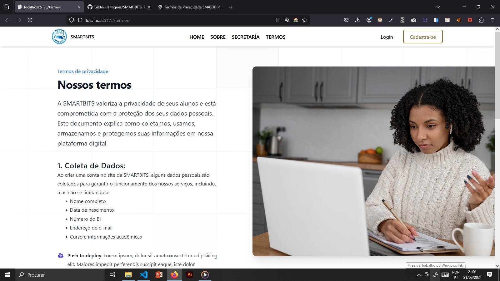
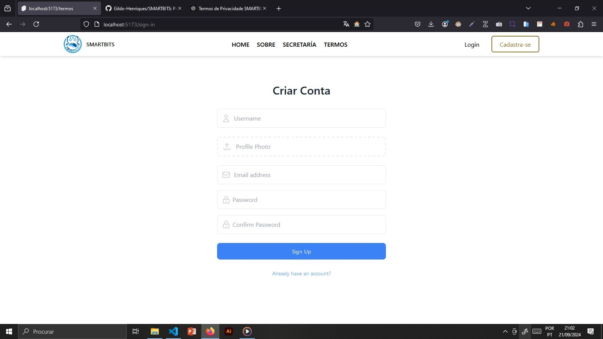
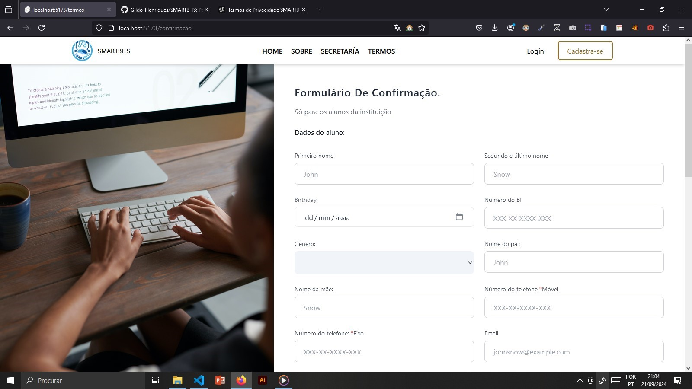
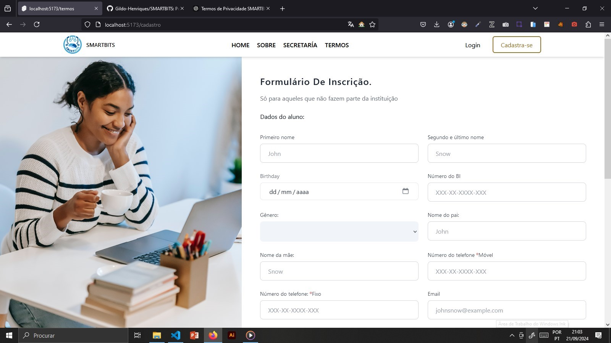

# SMARTBITS - Sistema de Gestão Acadêmica

**SMARTBITS** é uma plataforma digital desenvolvida para facilitar a gestão acadêmica dos alunos e da instituição de ensino, permitindo que os alunos possam acessar suas notas, realizar matrículas, fazer inscrição em cursos e acompanhar seu desempenho acadêmico. Esta plataforma foi projetada para instituições de ensino focadas em cursos de informática e de eletrônica e telecomunicações.

## Funcionalidades

- **Consulta de Notas**: Acesse as notas de forma rápida e segura.
- **Confirmação de Matrícula**: Realize a confirmação da matrícula diretamente na plataforma.
- **Inscrição em Disciplinas e Cursos**: Inscreva-se em novas disciplinas e cursos com facilidade.
- **Gerenciamento de Perfil**: Atualize suas informações pessoais e acompanhe seu histórico acadêmico.

## Tecnologias Utilizadas

- **Frontend**: [Svelte](https://svelte.dev) - Um framework de JavaScript eficiente e moderno.
- **Backend**: [Laravel](https://laravel.com) - Framework PHP robusto e com foco na simplicidade e produtividade.
- **Estilização**: [Tailwind CSS](https://tailwindcss.com) - Um framework CSS utilitário que facilita a criação de interfaces de usuário responsivas e personalizadas.

## Requisitos do Sistema

Para rodar o sistema **SMARTBITS**, certifique-se de que o ambiente tenha os seguintes requisitos:

### Backend
- **Linguagem**: PHP 8.0+
- **Framework**: Laravel 9+
- **Banco de Dados**: MySQL 5.7+ ou PostgreSQL 12+
- **Outros**: Composer (para gerenciar dependências do PHP)

### Frontend
- **Linguagem**: JavaScript (ES6+)
- **Framework**: Svelte 3+
- **Gerenciador de Pacotes**: Node.js 14+ e npm 6+
- **Estilos**: Tailwind CSS 3.0+

### Outros Requisitos
- **Servidor Web**: Nginx ou Apache
- **Serviços de Hospedagem**: PHP e MySQL/PostgreSQL

## Imagens







## Instalação

### 1. Clone o repositório
```bash
git clone https://github.com/smartbits/smartbits.git
cd smartbits
#